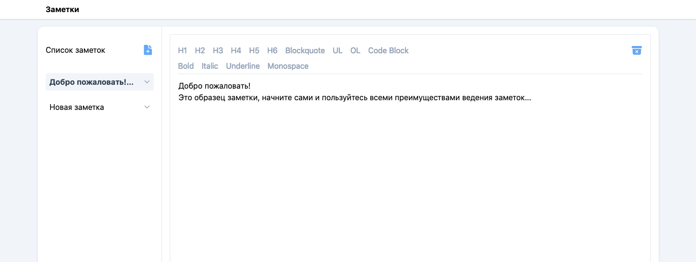

# Заметки - тестовое задание по стажёрской программе IT Hub «Северстали»

> Пример использования приложения.

## Описание

Это приложение **Заметки** создано рамках выполнения тестового задания по стажёрской программе IT Hub «Северстали». Исполнено для работы в браузере.
Позволяет:
- создавать одно или несколько текстовых заметок с возможностью стилистически изменять текст;
- редактировать заметки;
- удалять заметки;
- сохранение самих заметок и их количества между сеансами приожения;
- при первом запуске имеет предзаполненный образец заметки;
- названия заметок выводятся списком.

## Использованные технологии:

- [Vite](https://vitejs.dev/)
- [Babel](https://babeljs.io/)
- [React Router](https://reactrouter.com/)
- [ESLint](https://eslint.org/)
- [Prettier](https://prettier.io/)
- [Stylelint](https://stylelint.io/)
- [TailwindCSS](https://tailwindcss.com/)
- [Redux Toolkit](https://redux-toolkit.js.org/)

## Начало работы

Склонируйте репозиторий (сделайте локальную копию) и выполните следующие простые шаги.

### Предустановки

- Рекомендуется `node` : `>=16.13.0`
- `npm` or `pnpm` or `yarn`

### Установка

1. Скачайте или склонируйте репозиторий
2. Перейдите в корневой директорию проекта
3. Установите зависимости:

- `npm install` или `pnpm install` или `yarn`

## Скрипты

### Запустить dev server

- `npm run dev` или `pnpm run dev` или `yarn run dev` и откройте в браузере `http://localhost:5173`

### Запустить линтер:

- `npm run fix:eslint` или `yarn fix:eslint`
- `npm run lint:eslint` или `yarn lint:eslint`

### Запустить prettier:

- `npm run fix:prettier` или `yarn fix:prettier`

## Идеи для улучшения:
- Вставка картинок
- внедрение интернационализации
- добавление тестов
